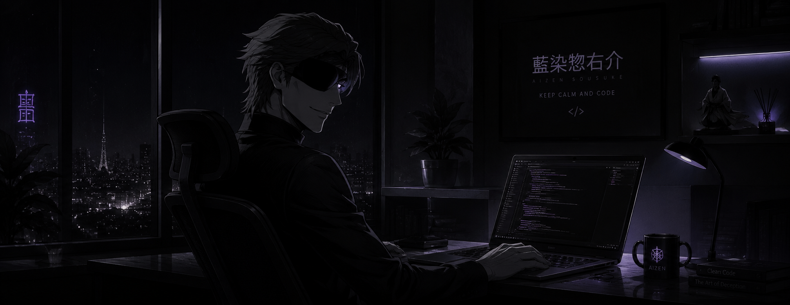

<!-- ═══════════════════════════════════════════════════════════════ -->
<!--                         HEADER SECTION                          -->
<!-- ═══════════════════════════════════════════════════════════════ -->

 

  

 

---

<!-- ═══════════════════════════════════════════════════════════════ -->
<!--                         ABOUT SECTION                           -->
<!-- ═══════════════════════════════════════════════════════════════ -->

<h2>🩸 THE SOUL REAPER PROFILE (About Me)</h2>

<i>
"Admiration is the furthest thing from understanding."
</i>

<table>
<tr>

<!-- LEFT: BLEACH VISUAL -->
<td width="40%" align="center" valign="middle">

  

</td>

<!-- RIGHT: ABOUT TEXT -->
<td width="60%" valign="top">

<h3>⚔️ Adil Khattak</h3>

I'm a <strong>Software Engineering student</strong>
who enjoys transforming ideas into
<strong>working software</strong>.

My journey moves between
<strong>web development</strong>,
<strong>mobile applications</strong>,
and the constantly evolving world of
<strong>Artificial Intelligence</strong>.

I believe every project is another
<strong>battle</strong>,
every bug is another
<strong>lesson</strong>,
and every commit is another step toward
<strong>evolution</strong>.

 

<h3>🌌 CURRENT STATE</h3>

🧠 <strong>Exploring Artificial Intelligence</strong>
 
⚔️ <strong>Learning Django</strong>
 
🚀 <strong>Building useful applications</strong>
 
🌌 <strong>Improving one project at a time</strong>

</td>

</tr>
</table>

---

<!-- ═══════════════════════════════════════════════════════════════ -->
<!--                         TECH SECTION                            -->
<!-- ═══════════════════════════════════════════════════════════════ -->

<h2>⚔️ My ZANPAKUTŌ Ability (Tech Arsenal)</h2>

<i>Every tool has a purpose. Every language has another form.</i>

 

<table>
<tr>

<!-- LEFT: TECH STACK -->
<td width="68%" valign="top">

<h3>🗡️ SEALED FORM — CORE LANGUAGES</h3>

  

<h3>🌌 SHIKAI — FRAMEWORKS & PLATFORMS</h3>

  

<h3>🩸 BANKAI TRAINING — TOOLS & DATABASES</h3>

</td>

<!-- RIGHT: BLEACH VISUAL -->
<td width="32%" align="center" valign="middle">

  

</td>

</tr>
</table>

---

<!-- ═══════════════════════════════════════════════════════════════ -->
<!--                    CURRENT JOURNEY SECTION                      -->
<!-- ═══════════════════════════════════════════════════════════════ -->

<h2>🌑 THE ROAD BEYOND SHIKAI</h2>

<i>
"The moment you stop learning is the moment your evolution ends."
</i>

<table>
<tr>

<!-- LEFT: JOURNEY CONTENT -->
<td width="60%" valign="top">

<strong>🧠 Current Focus</strong>

Exploring the foundations of Artificial Intelligence and learning how intelligent systems are built.

<strong>⚡ Status:</strong>

REIATSU DETECTED — EXPLORATION ACTIVE

  

<strong>⚔️ Current Training</strong>

Django is currently in my learning phase as I work toward building stronger and more scalable web applications.

<strong>⚡ Status:</strong>

BANKAI TRAINING — IN PROGRESS

  

<strong>🚀 Objective</strong>

Turn ideas into useful software and continue improving through every project I build.

<strong>⚡ Status:</strong>

THE NEXT FORM IS LOADING...

</td>

<!-- RIGHT: JOURNEY VISUAL -->
<td width="40%" align="center" valign="middle">

  

</td>

</tr>
</table>

---

<!-- ═══════════════════════════════════════════════════════════════ -->
<!--                         ANALYTICS                              -->
<!-- ═══════════════════════════════════════════════════════════════ -->

<h2>📊 REIATSU ANALYTICS (Spiritual Pressure Dashboard)</h2>

<i>Every contribution leaves a trace.</i>

  

---

<!-- ═══════════════════════════════════════════════════════════════ -->
<!--                         PROJECTS                               -->
<!-- ═══════════════════════════════════════════════════════════════ -->

<h2>🏯 RELEASED TECHNIQUES</h2>

<i>Ideas become real when they are built.</i>

<table>
<tr>

<td width="50%" valign="top">

<h3>🏋️ GymPass Portal</h3>

A multi-gym membership management system designed to organize gym memberships and related workflows.

  

</td>

<td width="50%" valign="top">

<h3>💼 Personal Portfolio</h3>

A personal portfolio website showcasing my skills, projects, and internship experience.

  

</td>

</tr>
</table>

---

<!-- ═══════════════════════════════════════════════════════════════ -->
<!--                         CONTACT                                -->
<!-- ═══════════════════════════════════════════════════════════════ -->

<h2>🦋 HELL BUTTERFLY NETWORK</h2>

<i>
"Even if you cannot see me, I will always be there."
</i>

 

&nbsp;&nbsp;

&nbsp;&nbsp;

  

  

<i>
"The next battle has already begun."
</i>

<strong>And the next commit is waiting.</strong>

---

<!-- ═══════════════════════════════════════════════════════════════ -->
<!--                           FOOTER                               -->
<!-- ═══════════════════════════════════════════════════════════════ -->

  

  

